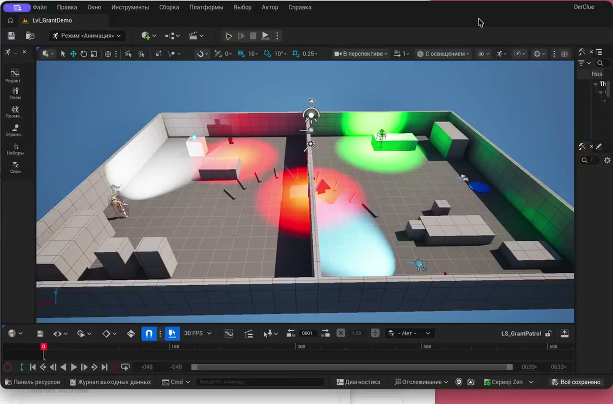

# Untitled Heist Game — prototype

An original modern heist-planning game that carries forward the design tradition of [The Clue!](https://en.wikipedia.org/wiki/The_Clue!) and [The Sting!](https://en.wikipedia.org/wiki/The_Sting!) for contemporary platforms.

> **Development update:** active production has moved to **Unreal Engine 5**. The earlier implementations are intentionally preserved below and in the repository history rather than being erased.

The project is currently only a **basic playable prototype** and vertical slice. Its first level demonstrates a compact 3D diorama, character movement, patrols, security observation and deterministic plan outcomes. The planned full game contains **180 levels of varying difficulty**; the current build is an early foundation for that larger campaign. The repository also preserves the earlier native Apple and Unity implementations as an engineering record of the project’s evolution.

## Implementations

- `UnrealPort/` — current Unreal Engine prototype and grant demonstration level.
- ~~`UnityPort/` — active Unity implementation~~ — preserved previous playable implementation and deterministic simulation core.
- ~~`DerClouApp/`, `Packages/` — active native Apple implementation~~ — preserved original Swift/RealityKit research implementation.
- `docs/` — design and technical history.

The complete, source-linked migration record is in [`docs/DEVELOPMENT_HISTORY.md`](docs/DEVELOPMENT_HISTORY.md).

## Короткая демонстрация

Видео автоматического прогона базового уровня (около 30 секунд): [скачать/посмотреть MP4](docs/media/derclou-grant-demo.mp4).

## Original project direction (archived)

The repository began as a native Apple-platform **top-down / 2.5D heist-planning puzzle game** built with Swift, SwiftUI and RealityKit, and later moved through a Unity implementation. Its central concept remains unchanged:

**Study the building → build a precise burglary plan → commit → watch the plan execute → learn from failure → improve the plan.**

The game is not intended to be a clone. It carries forward the high-level design grammar of reconnaissance, deterministic patrols, doors, cameras, alarms, tools, loot, timing and multi-character coordination while using original code, levels, characters, art and story.

## Current stage

The Unreal prototype is under active development. The present milestone focuses on proving the first complete visual gameplay loop before production art and content expansion.

This is an independent project with original code, content direction and game design. It is not affiliated with the creators or publishers of the referenced games.
