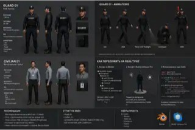

# Character Asset Pipeline

Status: production reference / character workflow

Purpose: define how generated character concepts become real animated 3D characters in the RealityKit game.

This document prevents a common mistake: **a generated character image is a visual reference, not a game-ready character asset.**

## Current visual reference

The first generated character-reference sheet is stored here:



Repository path:

`docs/images/character_reference_guard_civilian.svg`

The repository copy is a lightweight visual reference preview. When character production begins, retain the original/high-resolution generation source alongside the working 3D source files rather than treating this preview as texture input.

The reference establishes the current direction:

- realistic/stylized human proportions;
- readable silhouette from a high tactical camera;
- dark contemporary clothing;
- enough surface detail to look premium without requiring cinematic close-up density;
- characters that can share a compatible humanoid rig and animation library where practical.

It is **not** a locked character design and is **not** an asset to place directly in RealityKit.

---

## 1. Production chain

The intended workflow is:

```text
concept / reference sheet
        ↓
3D character mesh
        ↓
retopology / production topology
        ↓
UVs + PBR materials/textures
        ↓
humanoid skeleton / rig
        ↓
skinning / weight painting
        ↓
animation clips
        ↓
USD / USDZ export
        ↓
Reality Composer Pro 3
        ↓
RealityKit entity in the game
```

Every production character must reach the rigged/animated 3D stage before it replaces the current graybox capsule/proxy.

---

## 2. Concept/reference stage

Generated images are used to decide:

- body proportions;
- clothing silhouette;
- role readability;
- color/material family;
- equipment;
- hairstyle/headwear;
- distinguishing shapes visible from the tactical camera.

For 3D production, a useful reference set should include as many of these as possible:

- front view;
- side view;
- back view;
- three-quarter view;
- neutral A-pose or T-pose;
- close references for important clothing/equipment details.

Do not blindly reproduce generation artifacts, impossible seams, inconsistent pockets, asymmetric errors, or perspective distortions. The 3D artist/modeling stage resolves those into a coherent object.

---

## 3. 3D mesh

The character becomes an actual polygonal 3D object.

The mesh should be designed for the real gameplay camera, not for cinematic close-ups that the game never uses.

Priorities:

1. silhouette;
2. proportions;
3. readable head/torso/limbs;
4. clothing layers and major equipment;
5. clean deformation around shoulders, elbows, hips and knees;
6. efficient geometry appropriate for several visible actors on iPhone.

Do not spend the majority of the polygon budget on invisible facial microdetail while compromising animation or performance.

The game remains visually premium through good modeling, materials, lighting and animation rather than raw polygon count alone.

---

## 4. Scale and coordinate conventions

Project convention:

```text
1 RealityKit world unit = 1 meter
```

Character production should target plausible real-world scale.

Example starting point:

```text
adult character height ≈ 1.7–1.9 m
```

Exact variation is a design choice, but imports must not require arbitrary per-character correction factors.

Character origin/pivot should be at ground contact beneath the character, not at the chest or scene origin far away from the mesh.

The character's forward axis and export convention must remain consistent across the asset library.

Once the first production character is imported successfully, document the exact validated Blender/USD/RCP3 orientation convention here and reuse it for every later character.

---

## 5. UVs and materials

Characters should use normal game-ready UVs and PBR-oriented materials.

Typical material information may include:

- base color / albedo;
- normal detail;
- roughness;
- metallic where actually appropriate;
- opacity only when genuinely necessary;
- emissive only for equipment that needs it.

Avoid excessive unique materials per character. Material complexity has runtime cost and also makes the content pipeline harder to maintain.

The visual target is coherent semi-realistic/stylized PBR, not photorealistic skin rendering intended for close cinematic portraits.

---

## 6. Skeleton / rig

Animation requires a skeleton inside the mesh.

Conceptually:

```text
Root
└── Pelvis / Hips
    ├── Spine
    │   ├── Chest
    │   │   ├── Neck
    │   │   │   └── Head
    │   │   ├── LeftArm
    │   │   │   └── LeftForearm
    │   │   │       └── LeftHand
    │   │   └── RightArm
    │   │       └── RightForearm
    │   │           └── RightHand
    ├── LeftLeg
    │   └── LeftLowerLeg
    │       └── LeftFoot
    └── RightLeg
        └── RightLowerLeg
            └── RightFoot
```

The real production skeleton may contain additional joints for fingers, shoulders, twist bones, accessories, etc.

A compatible humanoid skeleton is strongly preferred for human characters because it allows animation reuse rather than creating a completely separate animation library for every guard, thief and civilian.

---

## 7. Skinning

The mesh is bound to the skeleton using skin weights.

This is what makes the visible body and clothing follow the bones.

Quality must be checked particularly around:

- shoulders;
- elbows;
- wrists;
- hips;
- knees;
- ankles;
- coat/jacket boundaries;
- belts, bags or rigid equipment.

A model can look excellent in a static render and still be unusable if the skinning collapses during walking or interaction animation. Therefore every candidate character must be deformation-tested before acceptance.

---

## 8. Initial animation library

We do **not** need hundreds of animations to begin production.

First useful set:

```text
Idle
Walk
Turn / directional transition
OpenDoor
Lockpick
UseElectronics
Inspect
TakeObject
OpenContainer / Safe interaction
Alert / React
```

Additional animations are added only when gameplay requires them.

Possible later additions:

```text
Crouch
Hide
CarryHeavyObject
UseCrowbar
UseDrill
DisableAlarm
FreePrisoner
PlantDevice
Escort / Follow
```

Animation naming should be systematic and independent of individual mission names.

---

## 9. Locomotion versus game movement

The animation must not become the authoritative source of mission simulation.

For this game:

```text
navigation / simulation determines where the character is
animation visually represents that movement
```

The planning system must retain deterministic movement timing.

A Walk clip should therefore not be allowed to unpredictably change gameplay travel distance or mission timing.

If root motion is evaluated later, it must be integrated in a way that preserves deterministic simulation rather than silently making animation drive game rules.

---

## 10. Character state and animation state

Gameplay state remains explicit in Swift.

Example:

```text
Character state: moving
        ↓
Animation presentation: Walk

Character state: idle
        ↓
Animation presentation: Idle

Character action: lockpick door_03
        ↓
Animation presentation: Lockpick
```

Reality Composer Pro Animation Graph may manage visual state transitions and blending where appropriate, while gameplay authority remains in Swift/system data.

Do not determine whether a lock is actually opened by merely checking whether an animation happened to finish visually.

---

## 11. Reusing animations

A major production goal is to keep compatible human characters on a shared or retargetable rig.

Desired model:

```text
Shared humanoid animation library
├── Idle
├── Walk
├── Turn
├── OpenDoor
├── Inspect
├── UsePanel
└── ...

Guard_01 mesh + compatible rig
Guard_02 mesh + compatible rig
Thief_01 mesh + compatible rig
Technician_01 mesh + compatible rig
Civilian_01 mesh + compatible rig
```

Role-specific clips can be added without duplicating ordinary locomotion.

This dramatically reduces the content burden as the campaign expands.

---

## 12. Export to Apple runtime content

Production assets should ultimately enter the Apple pipeline as USD/USDZ-compatible content suitable for Reality Composer Pro / RealityKit.

The exact export recipe must be tested with the first real character rather than assumed from theory.

The validation task for the first character is:

1. create/import the rigged mesh;
2. verify scale;
3. verify forward direction;
4. verify skeleton hierarchy;
5. verify skin deformation;
6. verify material appearance;
7. verify at least Idle and Walk animation import;
8. place it in the current graybox mission;
9. drive it using the existing character/navigation logic;
10. confirm animation and deterministic movement stay synchronized;
11. profile it on a real supported iPhone.

Record the proven exporter/version/settings here after this test succeeds.

---

## 13. Reality Composer Pro 3 role

RCP3 is used to integrate and inspect the actual game-ready character content:

- scene placement;
- materials;
- animation setup/graphs where compatible with our iOS 18 deployment floor;
- reusable character prototypes/entities;
- interaction anchors if needed;
- visual validation in representative lighting.

RCP3 is not the place where the original 2D concept magically becomes a rigged model. Modeling, rigging and skinning happen earlier in the pipeline.

---

## 14. RealityKit role

RealityKit receives the production character as a real 3D entity.

The gameplay entity should remain conceptually separable from its visual representation.

Current graybox:

```text
Character gameplay entity
└── Capsule visual proxy
```

Production:

```text
Character gameplay entity
└── Rigged Guard_01 visual model
```

The replacement should not require rewriting navigation, guard logic, plan recording, security detection or stable entity IDs.

This separation is mandatory.

---

## 15. Collision and gameplay footprint

Do not derive gameplay collision directly from every piece of detailed character geometry.

Use a stable simplified character collision/footprint appropriate to navigation and gameplay.

The detailed animated body is presentation.

This prevents moving limbs, clothing and accessories from introducing unpredictable gameplay collisions.

---

## 16. First production-character milestone

Before creating a large cast, build **one** complete character through the entire pipeline.

Recommended first test: one generic guard.

Acceptance criteria:

```text
[ ] visual design approved
[ ] real 3D mesh
[ ] correct project scale
[ ] clean UV/materials
[ ] humanoid skeleton
[ ] acceptable skinning
[ ] Idle animation
[ ] Walk animation
[ ] exported to validated USD/USDZ form
[ ] imported through RCP3/RealityKit
[ ] replaces current graybox capsule without gameplay rewrite
[ ] follows deterministic tap-to-move path
[ ] turns correctly
[ ] animation looks correct from tactical camera
[ ] tested on real iPhone
[ ] performance acceptable
```

Do not commission/generate/model ten characters before this single end-to-end path is proven.

---

## 17. Art-direction rule for tactical distance

The camera changes what matters.

At our gameplay distance the player notices, in roughly this order:

1. silhouette;
2. motion quality;
3. body orientation;
4. clothing contrast;
5. role-defining equipment;
6. broad material response;
7. large-scale details;
8. fine facial detail.

Therefore animation quality and readable silhouettes are higher production priorities than invisible microdetail.

This does **not** mean making primitive characters. It means spending detail where it survives the actual camera.

---

## 18. AI-generated 3D policy

AI-assisted mesh generation may be evaluated, but generated output is never assumed production-ready.

Any generated model must still pass:

```text
topology check
scale check
UV/material check
rig compatibility
skinning check
animation deformation check
license/IP provenance check
RealityKit import check
real-device performance check
```

If an automated generator produces a beautiful static model with unusable topology or rigging, it has not solved the production problem.

---

## 19. Source-file policy

Do not store only the final `.usdz` and throw away the editable source.

For production assets retain, as applicable:

```text
reference/concept
editable modeling source
textures/source materials
rigged source
animation source
exported runtime USD/USDZ
license/provenance notes
```

The exact asset-folder structure will be finalized after the first real character experiment.

---

## 20. Current next step

Do not interrupt the current graybox/navigation work merely to produce the entire character pipeline.

When the basic movement/camera/world scale is stable enough, the first character-specific experiment should be:

> Replace one capsule with one fully rigged generic guard using Idle + Walk, while preserving the existing gameplay entity, navigation and deterministic simulation.

That experiment will establish the real production rules for every later human character.
